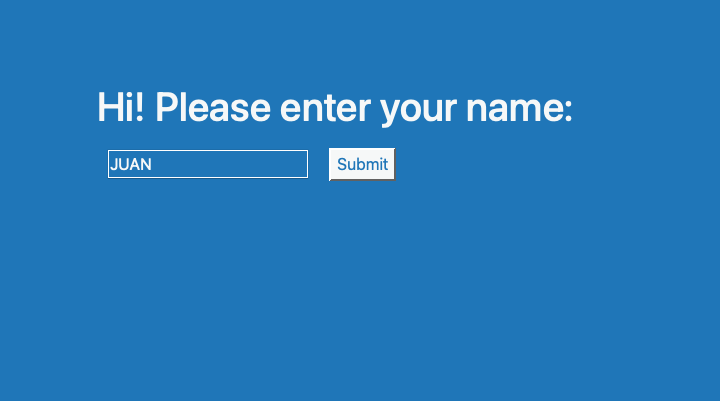
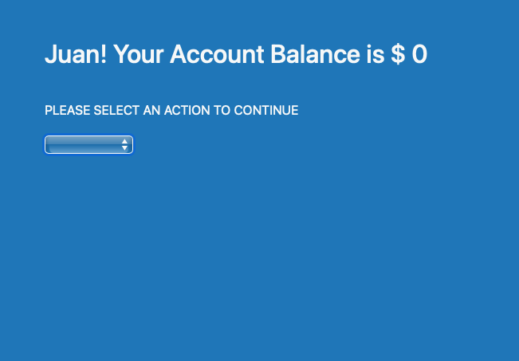
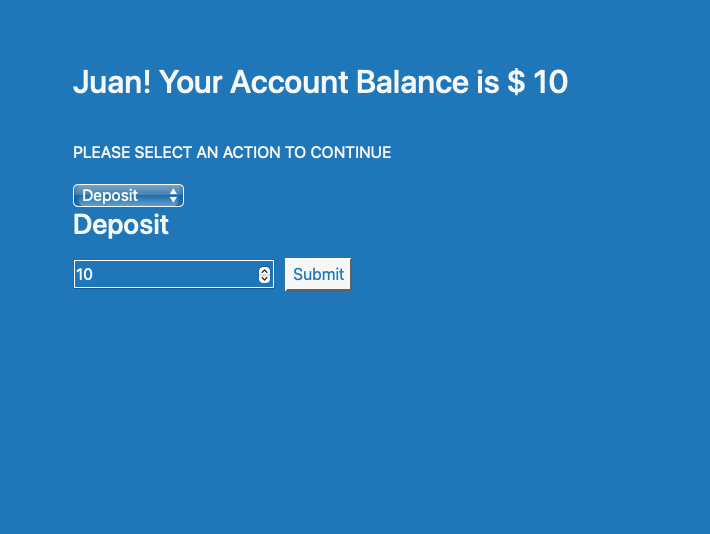

# Refactored_ATM

Refactored ATM

<h2>Description</h2>

 This is abasic ATM-machine app that uses the logic of a Bank's Account Balance to increment the amount by making a deposit or to decrease the amount by withdrawing money 

The project has three stages:

    <li>The first one is to insert a user's name</li>
    
    <li>The second reveals the user's account balance and asks for either a deposit ot a withdrawal</li>
    
    <li>The third part permits to input the amount to be deposited or withdrawn and modifies the account balance of the user</li>
    

<h2>Instalation</h2>
    <li>Copy the code of the repository</li>
    <li>On your terminal locate the folder in which you would like to take the files and then press: <strong> git clone </strong> and then paste the code copied on the repository</li>
    <li>Once the files are cloned to the local file, in your terminal write <strong>code .</strong>. this will eventually open VSCode </li>
    <li>Work on the website and apply all the changes needed and when the progress is considerable write in the terminal <strong> git all .</strong> this will appply all the changes</li>
     <li>Write <strong> git commit -m (any text with the changes made) </strong> this will commit all the changes made so far</li>
    <li>Whenever the code is ready to upload it to the repository write <strong>git push origin master</strong>. If it is not the master repository then the code to write is <strong>git push origin main</strong> this is the location of the main branch.

<h2>Usage</h2>
 
 
This project has been created in order to review some important content related to the use of React components as well as passing properties among components. It also shows the logic behing the creation of an App and at the end it keeps the record of the account balance of an individual just like if it were in a bank

 <h2>Support</h2>

If you are stuck somewhere in this code, please feel free to contact me at:

<h4>Email:</h4>

<a href="mailto:jplarraga@gmail.com">jplarraga@gmail.com</a>

<h4>Twitter:</h4>

@jplarraga

 

<h2>Roadmap</h2>

At the begining it was intended to show the logic of a user's account balance in a bak and how it is modified by a deposit or a withdrawal. Futher versions could implement the use od a validation of a user and a password to enter the platform and to have acces to personal transactions just like it were in a real ATM machine.

<h2>License Information</h2>

Copyright (c) 2021 Juan Larraga

Permission is hereby granted, free of charge, to any person obtaining a copy of this software and associated documentation files (the "Software"), to deal in the Software without restriction, including without limitation the rights to use, copy, modify, merge, publish, distribute, sublicense, and/or sell copies of the Software, and to permit persons to whom the Software is furnished to do so, subject to the following conditions:

The above copyright notice and this permission notice shall be included in all copies or substantial portions of the Software.

THE SOFTWARE IS PROVIDED "AS IS", WITHOUT WARRANTY OF ANY KIND, EXPRESS OR IMPLIED, INCLUDING BUT NOT LIMITED TO THE WARRANTIES OF MERCHANTABILITY, FITNESS FOR A PARTICULAR PURPOSE AND NONINFRINGEMENT. IN NO EVENT SHALL THE AUTHORS OR COPYRIGHT HOLDERS BE LIABLE FOR ANY CLAIM, DAMAGES OR OTHER LIABILITY, WHETHER IN AN ACTION OF CONTRACT, TORT OR OTHERWISE, ARISING FROM, OUT OF OR IN CONNECTION WITH THE SOFTWARE OR THE USE OR OTHER DEALINGS IN THE SOFTWARE. 

 